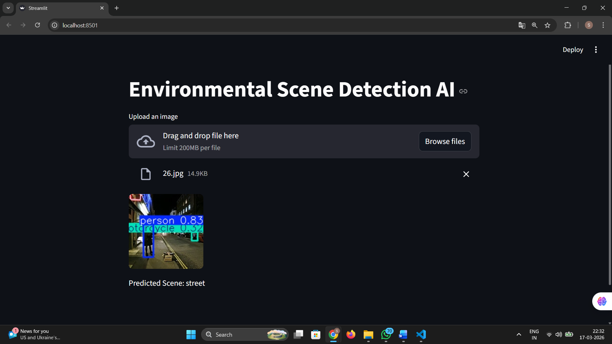

# 🧠 Real-Time Object Detection using YOLOv8 and Flask

## 🔥 Key Highlights

* Real-time object detection using YOLOv8
* Integrated with Flask web application
* Supports webcam and image input
* Detects multiple objects with bounding boxes
* Optimized for speed and performance

---

## 📌 Overview

This project is a **real-time object detection system** built using the **YOLOv8 deep learning model**. It detects objects from images and live webcam feed and displays the results through a **Flask-based web interface**.

The system can identify multiple objects simultaneously and draw **bounding boxes with labels and confidence scores**.

---

## 🚀 Features

* 🎥 Real-time detection using webcam
* 🖼️ Image upload detection
* ⚡ Fast and accurate predictions
* 🌐 User-friendly web interface
* 📦 Detects 80+ object classes (COCO dataset)

---

## 🛠️ Tech Stack

* Python
* Flask
* OpenCV
* Ultralytics YOLOv8
* NumPy
* HTML/CSS


---

## ⚙️ Installation

### 1️⃣ Clone the repository

```bash
git clone https://github.com/sanjanach-04/object-detection.git
cd object-detection
```

### 2️⃣ Create virtual environment

```bash
python -m venv venv
```

### 3️⃣ Activate environment

```bash
venv\Scripts\activate   # Windows
source venv/bin/activate  # Mac/Linux
```

### 4️⃣ Install dependencies

```bash
pip install -r requirements.txt
```

---

## ▶️ Run the Application

```bash
python app.py
```

Open your browser and go to:

```
http://127.0.0.1:5000/
```

---

## 🧠 How It Works

1. User opens the Flask web application
2. Webcam or image input is captured using OpenCV
3. Frame is passed to YOLOv8 model
4. Model detects objects with bounding boxes
5. Results are displayed in real-time on browser

---

## 📊 Dataset

The model is pre-trained on the **COCO dataset**, which includes 80 object categories such as:

* Person
* Car
* Dog
* Bicycle

---

## ⚠️ Challenges Faced

* Misclassification between similar objects
* Real-time performance optimization
* Integrating deep learning model with Flask

---

## 🔮 Future Improvements

* Train on custom datasets
* Deploy on cloud platforms (AWS/GCP)
* Convert to mobile or edge AI application
* Improve accuracy with fine-tuning

---

## 📸 Demo
    output
    


## 📌 Resume Description

Developed a real-time object detection system using YOLOv8 and Flask, capable of detecting multiple objects from webcam feed with high accuracy.

---
